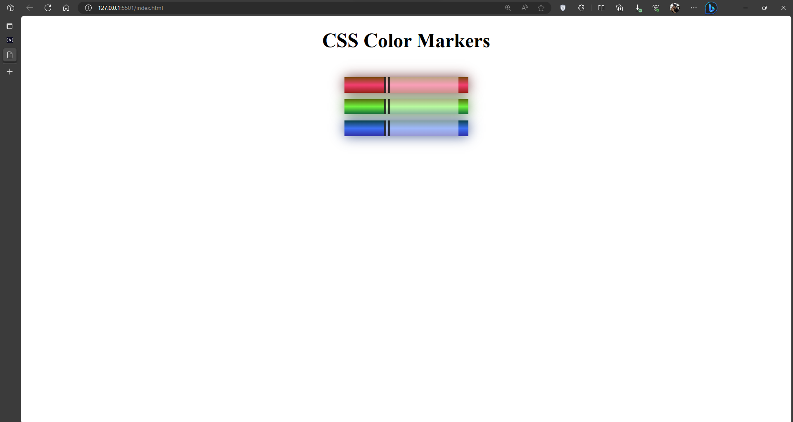
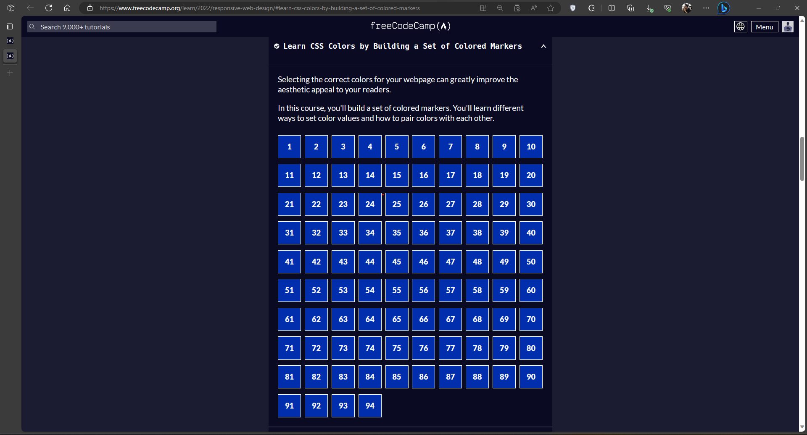

# Colored Markers
The purpose of this repo is to monitor my progress in learning HTML and CSS by making a set of colored markers. I am utilizing the freeCodeCamp [Learn CSS Colors by Building a Set of Colored Markers](https://www.freecodecamp.org/learn/2022/responsive-web-design/#learn-css-colors-by-building-a-set-of-colored-markers) for this repo.

## Screenshots

## Learnings
1. Understand more about classes
2. Learned the different approaches in applying colors like `rgb()`, `hsl()`, `hexadecimal`, and `color names`
